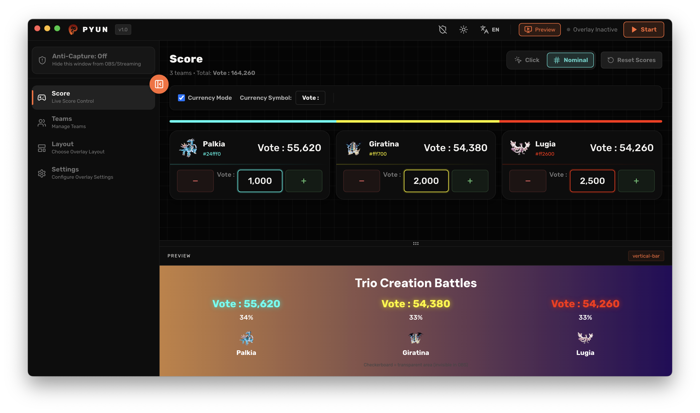

<div align="center">


# Pyun - Versus Overlay

### _Interactive overlay system for streamers and broadcasters_

[](https://nextjs.org/)

<!-- [](https://opensource.org/licenses/MIT) -->

</div>

---

## 📖 About Pyun

**Pyun** is a powerful, interactive overlay system designed specifically for streamers who need a dynamic "Versus" or "Score" display. Whether you're hosting a gaming tournament, a live debate, or a fundraising event, Pyun provides a sleek, customizable interface that integrates seamlessly with major streaming software like OBS, Streamlabs, and vMix.

---

## 🚀 Key Features

### 🎮 Live Score Control

Manage your data in real-time with ease.

- **Dynamic Updates**: Increment or decrement scores instantly.
- **Currency Mode**: Switch numerical displays to currency/donation formats.
- **Quick Reset**: Clear all data back to zero with a single click.

### 👥 Team Management

Define your participants with style.

- **Custom Branding**: Edit team names, upload logos, and choose custom colors.
- **Auto-Coloring**: New teams are automatically assigned unique colors for better visualization.
- **Flexible Scaling**: Support for multiple teams (minimum 2).

### 🎨 Diverse Layouts

Choose from various visual styles to match your content:

- **Standard/Horizontal**: Classic bar style for top/bottom placement.
- **Bubbles**: Interactive floating bubbles that scale with the score.
- **Avatar VS**: Fighting-game style with health bars and profile photos.
- **Speedometer**: Automotive-style needle gauges.
- **Neon Stack**: Glowing neon blocks that light up as scores increase.

### ⚙️ Professional Settings

- **Localization**: Full support for **English** and **Indonesian**.
- **Visual Fine-tuning**: Control opacity, animation speed, and global font sizes.
- **Integration Helper**: Step-by-step guides for OBS, Streamlabs, vMix, and XSplit.

---

## 🛡️ Specialized Features

- **Anti-Capture (Privacy Shield)**: Hide your Control Panel from streaming software while keeping it visible to you.
- **Live Preview**: Real-time feedback loop with a checkerboard background to visualize transparency.
- **Detached Window Architecture**: The overlay runs in a separate window, making it easy to capture with transparency support without extra plugins.

---

## 🛠️ Getting Started

### Prerequisites

- Node.js (v18 or higher recommended)
- npm or yarn

### Installation

1. Clone the repository
2. Install dependencies:
   ```bash
   npm install
   ```
3. Run the development server:
   ```bash
   npm run dev
   ```
4. Open [http://localhost:3000](http://localhost:3000) in your browser.

---

## 📺 OBS Integration

1. Open the **Overlay Window** in Pyun.
2. In OBS, add a new **Window Capture** source.
3. Select the Pyun Overlay window.
4. (Optional) Use the **Area Drag** feature in Settings to position the overlay perfectly.

---

<div align="center">
Made with ❤️ for the Streaming Community
</div>
